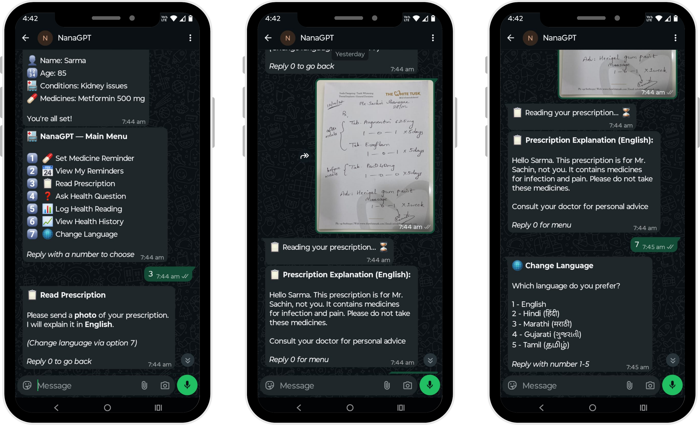

<p align="center">
  
</p>

# NanaGPT: WhatsApp Health Companion for Elderly Care

A WhatsApp-based AI health assistant for senior citizens, powered by ASI:ONE. No app to install. No new interface to learn. Just WhatsApp.

---

## Overview

NanaGPT helps elderly individuals manage their daily healthcare through simple WhatsApp messages. It handles medicine reminders, prescription explanations, health question answering, and health log tracking — all in the user's preferred Indian language.

---

## Features

| Feature | Description |
|---|---|
| Onboarding Profile | Collects name, age, conditions, medicines, and prescription image on first use |
| Medicine Reminders | Natural language input → structured reminder → automatic WhatsApp delivery |
| Prescription Reader | Photo of prescription → plain-language explanation in user's language |
| Health Q&A | Ask any health question, answered with awareness of user's medical profile |
| Health Log | Log BP, blood sugar, weight — stored with timestamps, viewable as history |
| Multilingual | English, Hindi, Marathi, Gujarati, Tamil — changeable anytime |

---

## Architecture

```
WhatsApp User
     |
     v
Meta WABA Webhook  (POST /webhook)
     |
     v
Flask App  (Render)
     |
     ├── State Machine  (onboarding / menu / reminder / prescription / ...)
     ├── ASI:ONE API    (language understanding, vision, multilingual replies)
     ├── SQLite DB      (user profiles, reminders, health logs, chat history)
     └── APScheduler    (reminder delivery — checks every minute)
```

---

## Tech Stack

- **AI** — [ASI:ONE](https://asi1.ai) (`asi1-mini`)
- **Backend** — Python, Flask
- **Database** — SQLite
- **Scheduler** — APScheduler
- **WhatsApp** — Meta WhatsApp Business API (WABA)
- **Hosting** — Render

---

## How ASI:ONE Is Used

ASI:ONE is the core intelligence layer. It is accessed via an OpenAI-compatible API, integrated using the standard Python `openai` SDK with a custom `base_url`.

**Personalized responses** — Every API call includes a dynamically built system prompt with the user's name, known conditions, and current medicines. Responses are contextual, not generic.

**Multilingual output** — The system prompt instructs ASI:ONE to respond in the user's selected language and correct script (Devanagari for Hindi/Marathi, Gujarati script, Tamil script).

**Structured data extraction** — ASI:ONE embeds structured JSON inside custom tags in its response:
```
<REMINDER>{"medicine":"Metformin","time":"08:00","frequency":"daily"}</REMINDER>
<HEALTHLOG>{"type":"BP","value":"130/85"}</HEALTHLOG>
```
These are parsed by the app and written to the database. The tags are stripped before the reply reaches the user.

**Prescription image analysis** — Prescription photos are downloaded, converted to base64, and sent to ASI:ONE as vision input. The model returns a structured explanation in the user's language.

**Conversation context** — The last three exchanges are retrieved from SQLite and included in every API call, maintaining session context across stateless webhook requests.

---

## Project Structure

```
nanagpt/
├── app.py                  # Flask app, webhook handler, state machine
├── asi_handler.py          # ASI:ONE API calls, prompt building, tag extraction
├── whatsapp.py             # WABA message sending, media download
├── firebase_handler.py     # SQLite operations (users, reminders, logs, history)
├── reminder_scheduler.py   # APScheduler — sends due reminders every minute
├── requirements.txt
├── render.yaml             # Render deployment config
└── .env                    # Environment variables (not committed)
```

---

## Setup

### 1. Clone the repository

```bash
git clone https://github.com/yourusername/nanagpt.git
cd nanagpt
```

### 2. Install dependencies

```bash
pip install -r requirements.txt
```

### 3. Configure environment variables

Create a `.env` file:

```env
ASI_API_KEY=your_asi_one_api_key
ASI_BASE_URL=https://api.asi1.ai/v1
ASI_MODEL=asi1-mini

WHATSAPP_TOKEN=your_meta_permanent_access_token
PHONE_NUMBER_ID=your_whatsapp_phone_number_id
WEBHOOK_VERIFY_TOKEN=your_chosen_verify_token

CAREGIVER_PHONE=91XXXXXXXXXX
```

### 4. Run locally

```bash
python app.py
```

### 5. Expose locally with ngrok (for webhook testing)

```bash
ngrok http 5000
```

Use the generated `https://` URL as your webhook in the Meta Developer Portal.

---

## Deployment on Render

1. Push the repository to GitHub
2. Go to [render.com](https://render.com) → New Web Service → Connect repository
3. Set build command: `pip install -r requirements.txt`
4. Set start command: `gunicorn app:app --bind 0.0.0.0:$PORT --workers 1`
5. Add all environment variables from `.env` in the Render dashboard
6. Deploy — your webhook URL will be `https://your-app.onrender.com/webhook`

---

## WhatsApp Business API Setup

1. Create an app at [developers.facebook.com](https://developers.facebook.com) → Business type
2. Add the WhatsApp product
3. Under WhatsApp → Configuration, set:
   - **Callback URL**: `https://your-app.onrender.com/webhook`
   - **Verify Token**: value of `WEBHOOK_VERIFY_TOKEN` in your `.env`
4. Subscribe to the `messages` webhook field
5. For a permanent access token, create a System User in Meta Business Manager with `whatsapp_business_messaging` permission

---

## User Flow

```
First message (Hi)
  └── Onboarding
        ├── Name
        ├── Age
        ├── Known conditions
        ├── Current medicines
        └── Prescription photo (optional)
              └── Main Menu

Main Menu
  ├── 1 - Set Medicine Reminder
  ├── 2 - View My Reminders
  ├── 3 - Read Prescription
  ├── 4 - Ask Health Question
  ├── 5 - Log Health Reading
  ├── 6 - View Health History
  └── 7 - Change Language

Reply 0 anytime → Main Menu
```

---

## Requirements

```
flask==3.0.3
openai==1.30.5
httpx==0.27.0
requests==2.32.3
APScheduler==3.10.4
python-dotenv==1.0.1
gunicorn==22.0.0
Pillow==10.4.0
```

---

## Environment Variables Reference

| Variable | Description |
|---|---|
| `ASI_API_KEY` | API key from ASI:ONE dashboard |
| `ASI_BASE_URL` | `https://api.asi1.ai/v1` |
| `ASI_MODEL` | `asi1-mini` |
| `WHATSAPP_TOKEN` | Meta permanent system user token |
| `PHONE_NUMBER_ID` | WhatsApp phone number ID from Meta dashboard |
| `WEBHOOK_VERIFY_TOKEN` | Any string you choose — must match Meta webhook config |
| `CAREGIVER_PHONE` | Caregiver's number in E.164 format without `+` (e.g. `919876543210`) |

---
## Implementation Screenshots

<p align="center">
  
</p>

---

## Notes

- SQLite data is stored in `seniorcare.db` on the server filesystem. On Render's free tier, this file resets on redeployment. For production use, migrate to a hosted database such as PostgreSQL or Firebase Firestore.
- The Meta temporary access token expires every 24 hours. Use a System User permanent token for any deployment beyond local testing.
- ASI:ONE's vision capability is used for prescription reading. Ensure images sent by users are reasonably well-lit and in focus for accurate results.

---

## Team

<p align="left">
  <a href="mailto:teaminspire2226@gmail.com">
    
  </a>
</p>

- [Tejas Gadge](https://www.linkedin.com/in/tejas-gadge-8a395b258/)
- [Anisha Shankar](https://www.linkedin.com/in/anisha-shankar-/)
